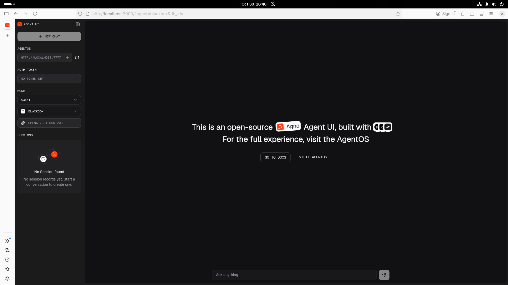

# ChatGPT-style Demos

## Add agent-ui
This will be the chat ui interface; clone into the same directory
```shell
git clone https://github.com/agno-ai/agent-ui
```

Open a new terminal window, change into the agent-ui directory and run the install and dev commands
```shell
cd agent-ui
pnpm install
pnpm dev
```

```shell
❯ git clone https://github.com/agno-agi/agent-ui
Cloning into 'agent-ui'...
remote: Enumerating objects: 3506, done.
remote: Counting objects: 100% (1001/1001), done.
remote: Compressing objects: 100% (289/289), done.
remote: Total 3506 (delta 880), reused 715 (delta 712), pack-reused 2505 (from 1)
Receiving objects: 100% (3506/3506), 710.19 KiB | 3.55 MiB/s, done.
Resolving deltas: 100% (2173/2173), done.
❯ cd agent-ui
❯ pnpm install
Lockfile is up to date, resolution step is skipped
Packages: +528
+++++++++++++++++++++++++++++++++++++++++++++++++++++++++++++++++++++++++++++++++++++++++++++++++++++++++++++++++++++++++++++++++++++++++++++++++++++++++++++++++++

   ╭──────────────────────────────────────────╮
   │                                          │
   │   Update available! 10.13.1 → 10.20.0.   │
   │   Changelog: https://pnpm.io/v/10.20.0   │
   │     To update, run: pnpm add -g pnpm     │
   │                                          │
   ╰──────────────────────────────────────────╯

Progress: resolved 528, reused 528, downloaded 0, added 528, done

dependencies:
+ @radix-ui/react-dialog 1.1.5
+ @radix-ui/react-icons 1.3.2
+ @radix-ui/react-select 2.1.5
+ @radix-ui/react-slot 1.1.1
+ @radix-ui/react-tooltip 1.1.7
+ class-variance-authority 0.7.1
+ clsx 2.1.1
+ dayjs 1.11.13
+ framer-motion 12.4.1
+ lucide-react 0.474.0
+ next 15.2.3
+ next-themes 0.4.4
+ nuqs 2.3.2
+ prettier-plugin-tailwindcss 0.6.11
+ react 18.3.1
+ react-dom 18.3.1
+ react-markdown 9.0.3
+ rehype-raw 7.0.0
+ rehype-sanitize 6.0.0
+ remark-gfm 4.0.0
+ sonner 1.7.4
+ tailwind-merge 3.0.1
+ tailwindcss-animate 1.0.7
+ use-stick-to-bottom 1.0.46
+ zustand 5.0.3

devDependencies:
+ @eslint/eslintrc 3.2.0
+ @types/node 20.17.16
+ @types/react 19.0.8
+ @types/react-dom 19.0.3
+ eslint 9.19.0
+ eslint-config-next 15.2.3
+ postcss 8.5.1
+ prettier 3.4.2
+ tailwindcss 3.4.17
+ typescript 5.7.3

╭ Warning ───────────────────────────────────────────────────────────────────────────────────╮
│                                                                                            │
│   Ignored build scripts: sharp.                                                            │
│   Run "pnpm approve-builds" to pick which dependencies should be allowed to run scripts.   │
│                                                                                            │
╰────────────────────────────────────────────────────────────────────────────────────────────╯

Done in 4.6s using pnpm v10.13.1
❯ pnpm dev

> agent-ui@0.1.0 dev /home/mrhillsman/Development/pycharm/afrotech-connect-and-control/agent-ui
> next dev -p 3000

   ▲ Next.js 15.2.3
   - Local:        http://localhost:3000
   - Network:      http://192.168.4.52:3000

 ✓ Starting...
 ✓ Ready in 1534ms
```

Visit http://localhost:3000 to view the AgentUI chat interface

## Start the agno agent framework
If your system does not automatically create the python virtual environment create it manually
Python's uv library is recommended but you can also use venv
```shell
# From the repo main directory, make sure you have uv or venv installed

# uv
uv venv --python 3.12 && source .venv/bin/activate
uv sync

# venv
python -m venv .venv && source .venv/bin/activate
pip install -r requirements.txt
```

NOTE: Make sure you are using the right virtual environment; search online or reach out via an issue if you need assistance

Now that the virtual environment is setup and agent-ui is running start the agno framework script

```shell
# uv
uv run --active main.py

# venv
python main.py
```

```shell
❯ uv run --active main.py
/home/mrhillsman/Development/pycharm/afrotech-connect-and-control/main.py:152: DeprecationWarning: 
        on_event is deprecated, use lifespan event handlers instead.

        Read more about it in the
        [FastAPI docs for Lifespan Events](https://fastapi.tiangolo.com/advanced/events/).
        
  @app.on_event("startup")
╔══════════════ AgentOS ══════════════╗
║                                     ║
║                                     ║
║        https://os.agno.com/         ║
║                                     ║
║                                     ║
║  Running on: http://localhost:7777  ║
║                                     ║
║                                     ║
╚═════════════════════════════════════╝
INFO:     Started server process [73122]
INFO:     Waiting for application startup.
INFO:     Application startup complete.
INFO:     Uvicorn running on http://localhost:7777 (Press CTRL+C to quit)
```

Visiting http://localhost:3000 should look like this screenshot:

